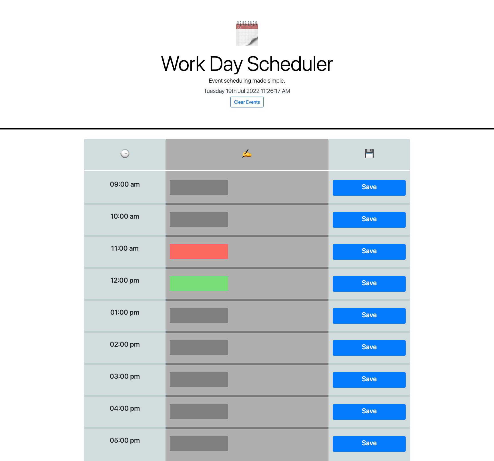

# Work-Day-Scheduler
Third-Party APIs Challenge: Work Day Scheduler

## Description 

Designed for an employee with a busy schedule, this web application can allow for a user to input their work day tasks into a clean, and responsive scheduler/planner. This application utilizes Moment.js for accurate saving of tasks. 

## Criteria

* The current day is displayed at the top of calendar using moment.js
* Time blocks represent task input fields
* Task input persists on the page if chosen to save
* The current hour is highlighted for ease of use

## Screenshots

## Live Deployed Link

[Link](https://brandtdavidson.github.io/Work-Day-Scheduler/)

## Credits

Brandt Davidson, 2022